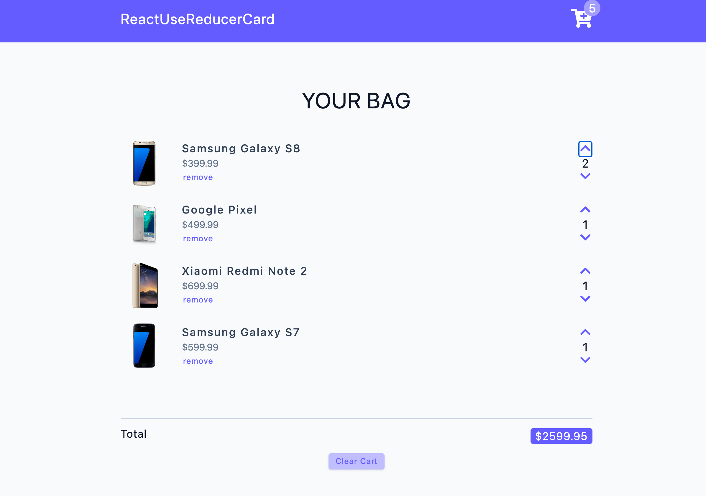

## ReactUseReducerCart

This React project focuses on building a cart management system using the `useReducer` hook. The main functionalities include clearing the cart, removing items, increasing and decreasing item quantities, calculating totals, and fetching data from an API. The project utilizes `global context` and a `reducer` to manage the `state` of the cart, which is implemented using the object data structure for efficient lookups and updates.

## Tech Stack
- `JavaScript`: The foundational programming language for creating responsive and interactive features.
- `React`: The powerful JavaScript library used to build the project: 
- - `useState` The React hook used to manage state.
- - `createContext`: The React hook used for creating a context object to share data across components in the component tree.
- - `useContext`: The React hook used to access the value provided by a context and subscribe to its changes in functional components.
- - `useReducer`: React hook for handling complex state management through dispatched actions.
- `React Icons`: The popular library that provides a vast collection of icons for enhancing the user interface and user experience in the project.

### Explore The Website
[ReactUseReducerCart on Netlify](https://react-use-reducer-cart.netlify.app)

### Preview

